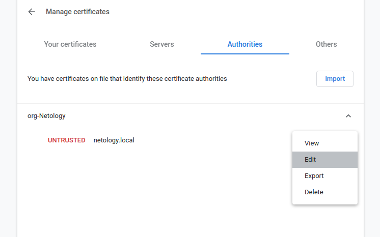
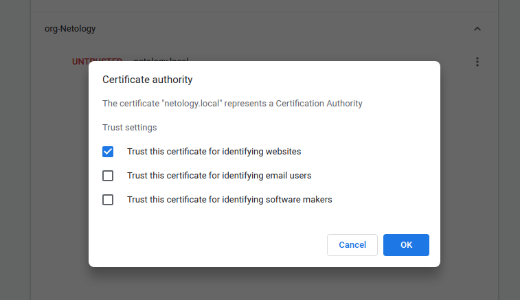
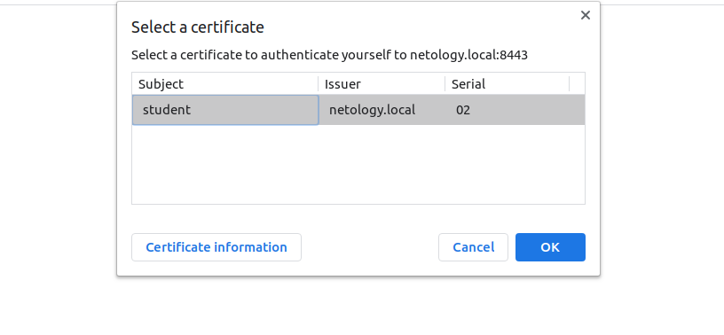

# Домашнее задание к занятию «1.2. Механизмы идентификации, аутентификации, авторизации и безопасного хранения данных о пользователях»

Пришлите ответы на вопросы в личном кабинете студента на сайте [netology.ru](https://netology.ru).

## Задание аутентификация по сертификатам X.509

### Описание

Вы настроите аутентификацию клиентов по сертификатам X.509 на nginx. Вместо nginx можно использовать любой web-сервер, в том числе самописный или встроенный в целевое приложение.

Для повторения теории по сертификатам и цепочкам доверия пересмотрите лекции 1 и 2.

### Этапы выполнения

#### Часть 1. Создание сертификатов и ключей

1\. Сначала создайте приватный ключ для Certificate Authority, с помощью которых затем создадите сертификат для сервера и подпишите все клиентские запросы сертификатов.

```shell
openssl genrsa -aes256 -out ca.key 4096
```

2\. Создайте CA certificate.

```shell
openssl req -new -x509 -sha256 -days 4096 -key ca.key -out ca.crt \
-subj "/C=RU/ST=Moscow/L=Moscow/O=Netology/OU=Security/CN=netology.local"
```

3\. Проверьте информацию о сертификате.

```shell
openssl x509 -in ca.crt -noout -text
```

4\. Создайте ключ для сервера и запрос на сертификат для использования HTTPS.

```shell
openssl genrsa -out server.key 4096
```

```shell
openssl req -new -key server.key -out server.csr \
-subj "/C=RU/ST=Moscow/L=Moscow/O=Security/OU=Security/CN=netology.local" \
-addext "subjectAltName = DNS:netology.local"
```

5\. Проверьте информацию о запросе.

```shell
openssl req -in server.csr -text -verify -noout
```

6\. Подпишите запрос и выдайте сертификат серверу.

```shell
openssl x509 -req -sha256 -days 4096 -in server.csr -CA ca.crt -CAkey ca.key -set_serial 01 -out server.crt -extfile <(printf "subjectAltName=DNS:netology.local")
```

7\. Создайте ключ и запрос на подпись сертификата для каждого клиента. 

```shell
openssl genrsa -aes256 -out client.key 4096
```

```shell
openssl req -new -key client.key -out client.csr \
-subj "/C=RU/ST=Moscow/L=Moscow/O=Netology/OU=Security/CN=student/emailAddress=student@netology.local"
```

8\. Проверьте информацию о запросе.

```shell
openssl req -in client.csr -text -verify -noout
```

9\. Подпишите запрос и выдайте сертификат клиенту на 1 день.

```shell
openssl x509 -req -sha256 -days 1 -in client.csr -CA ca.crt -CAkey ca.key -set_serial 02 -out client.crt
```

10\. Проверьте информацию о сертификате.

```shell
openssl x509 -in client.crt -noout -text
```

11\. Экспортируйте сертификат в формат PFX для дальнейшей установки в браузер.

```shell
openssl pkcs12 -export -out client.pfx -inkey client.key -in client.crt -certfile ca.crt
```

#### Часть 2. Настройка nginx

Готовая конфигурация nginx.

```text
http {
    include /etc/nginx/mime.types;
    default_type application/octet-stream;

    log_format main '$remote_addr [$ssl_client_s_dn] - $remote_user [$time_local] "$request" '
                    '$status $body_bytes_sent "$http_referer" '
                    '"$http_user_agent" "$http_x_forwarded_for"';

    access_log /var/log/nginx/access.log main;

    sendfile on;
    keepalive_timeout 65;
    include /etc/nginx/conf.d/*.conf;

    server {
        # имя нашего сервера
        server_name netology.local;

        # слушаем на 443 порту
        listen 443 ssl;
        listen [::]:443 ssl;
        # пути к сертификату и ключу
        ssl_certificate /etc/nginx/certs/server.crt;
        ssl_certificate_key /etc/nginx/certs/server.key;
        # какие протоколы поддерживаем
        ssl_protocols TLSv1.3;
        
        # путь к CA
        ssl_client_certificate /etc/nginx/certs/ca.crt;
        # включение верификации
        ssl_verify_client on;

        # где искать файлы, выдаваемые пользователю
        root /var/www/html;

        # какой файл выдавать по умолчанию
        index index.html index.htm index.nginx-debian.html;

        location / {
            try_files $uri $uri/ =404; 
        }     
    }

    server {
        server_name netology.local;

        if ($host = netology.local) {
            return 301 https://$host$request_uri;
        }

        listen 80;
        listen [::]:80;

        return 404;
    }
}
```

**Важно**: вам нужно целиком заменить содержимое секции `http {}` в `/etc/nginx/nginx.conf` на то, что дано выше.

#### Часть 3. Настройка Google Chrome

0\. В /etc/hosts пропишите строку.

```text
127.0.0.1 netology.local
```

1\. В адресной строке Google Chrome вбейте адрес `chrome://settings/certificates`, и вы попадёте на страницу, как на скрине.


2\. Импортируйте файл client.pfx с помощью кнопки Import.


3\. Перейдите на вкладку Authorities, найдите org-Netology и выберите в меню пункт Edit.



4\. Поставьте флажок, как на скриншоте.



5\. Перейдите по адресу https://netology.local. Убедитесь, что вам предлагают выбрать клиентский сертификат и в строке
подключений нет никаких предупреждений о неправильно установленном сертификате.



6\. Зайдите в настройки сертификата.


7\. Сделайте скриншот информации о сертификате.


7\. Удалите клиентский сертификат — вкладка Your certificates. Перезапустите браузер и убедитесь, что получите ошибку, как на скрине.


### Решение задания

Для выполнения задания пришлите документы:

1. Файлы ca.crt, client.pfx и пароль для импорта, server.crt.
2. Скриншот страницы с информацией о сертификате.


## Задание «Аутентификация»

Это задание необязательное. Его невыполнение не влияет на получение зачёта по домашнему заданию.

### Описание

Разработчики подготовили прототип будущей системы интернет-банка. Для запуска можно использовать команду `docker run -p 9999:9999 ghcr.io/netology-code/ibweb-auth:latest`.

Для входа используйте данные (сервис предоставляет веб-интерфейс на 9999 порту):
* логин/пароль: vasya/qwerty123;
* код подтверждения: 12345.

### Задача

Используя инструменты разработчика браузера, исследуйте, где приложение хранит токен и как его отправляет с каждым запросом после аутентификации. Мы рекомендуем использовать браузеры Google Chrome или Chromium.

### Этапы выполнения

1\. Аутентифицируйтесь под этой учётной записью.

2\. Откройте инструменты разработчика (Ctrl + Shift + I либо F12) и перейдите на вкладку `Application`.


3\. Исследуйте раздел `Storage` и выясните, в каком хранилище хранится токен доступа.

4\. Подтвердите результаты своих исследований: удалите токен доступа и обновите страницу, находясь на странице Личный кабинет. Вас должно «перебросить» на страницу входа.

5\. Снова аутентифицируйтесь и исследуйте панель `Network` на предмет запросов, которые отправляет браузер, а именно `/api/cards`.

6\. Выясните, в какой части запроса отправляется токен доступа.

### Решение задания

В качестве результата пришлите ответы на вопросы:

1. В каком хранилище и какие данные хранятся после аутентификации, хранится ли что-то ещё помимо токена аутентификации?
2. В какой части запроса и в каком виде отправляется токен доступа?
