# Домашнее задание к занятию «DevSecOps и AppSec. Часть 2»

Пришлите ответы на вопросы в личном кабинете на сайте [netology.ru](https://netology.ru).

## Описание

Домашнее задание — лабораторная работа, в которой вы по инструкциям выполните действия.

Обратите внимание, что домашнее задание является необязательным. Его выполнение не повлияет на получение зачёта по модулю.

## Задание GitLab

В этом задании применяется сервис GitLab — один из комплексных и самых популярных решений для поддержки DevOps и DevSecOps.

Вы будете использовать пробную версию из облака для упрощения настройки и развёртывания.

Командой GitLab уже подготовлены и настроены инструменты, которые позволяют выполнять действия:
1. Анализировать код на уязвимости — SAST, включая зависимости — SCA или Dependency Scanning.
2. Анализировать контейнеры на уязвимости — Container Scanning.
3. Анализировать используемые в проекте лицензии — License Scanning.
4. Проверять секреты — Secret Detection.

Список всех проверок доступен по адресам:
* https://gitlab.com/gitlab-org/gitlab/-/tree/master/lib/gitlab/ci/templates/Security;
* https://docs.gitlab.com/ee/user/application_security/ (документация).

### Этапы выполнения

1\. Перейдите по адресу https://gitlab.com/. Для использования всех возможностей необходимо зарегистрироваться и получить 30-дневный доступ. Нажмите Get free trial.
Перейдите по [ссылке](https://gitlab.com/-/trial_registrations/new) и зарегистрируйте новую учётную запись. Попросит подтвердить почтовый ящик, поэтому указываем действую почту.

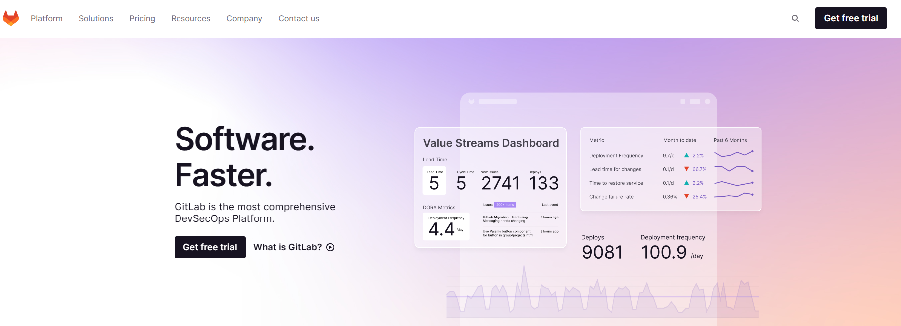

2\. Заполните данные форм. Вводите существующий адрес электронной почты. Он нужен для верификации аккаунта.

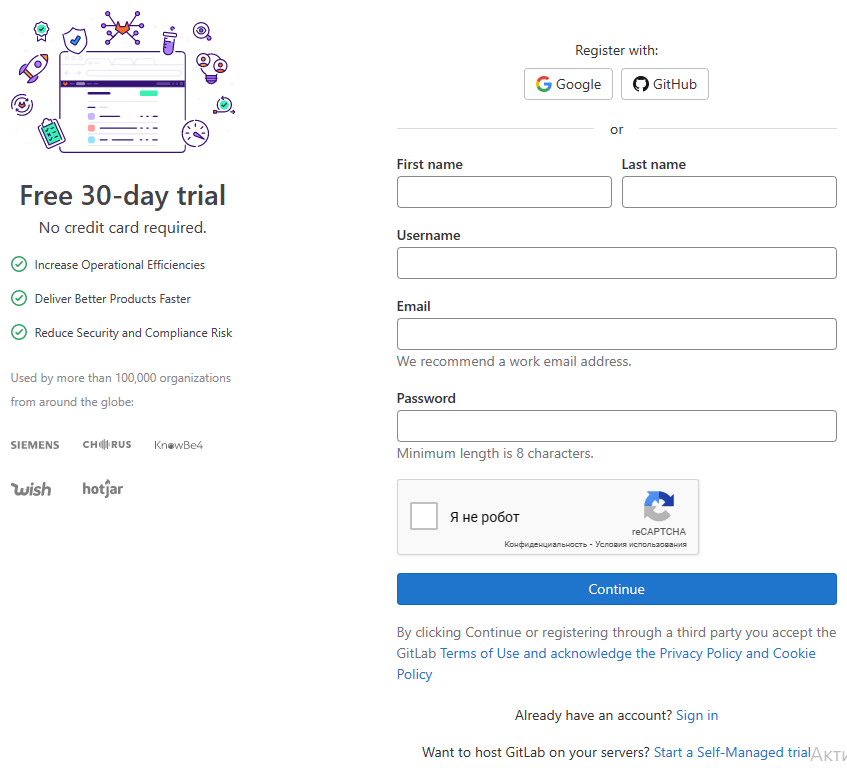

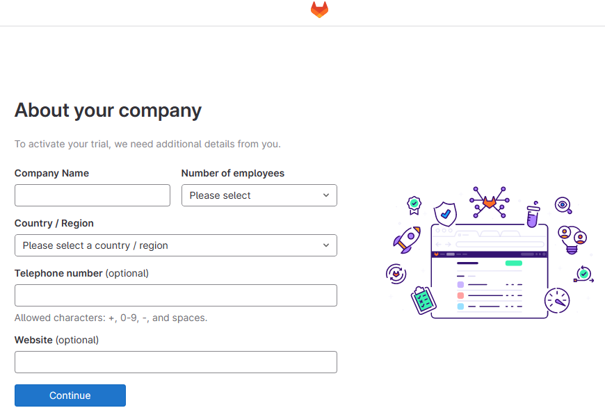

3\. Во вкладке Create заполните поля и нажмите Create project.

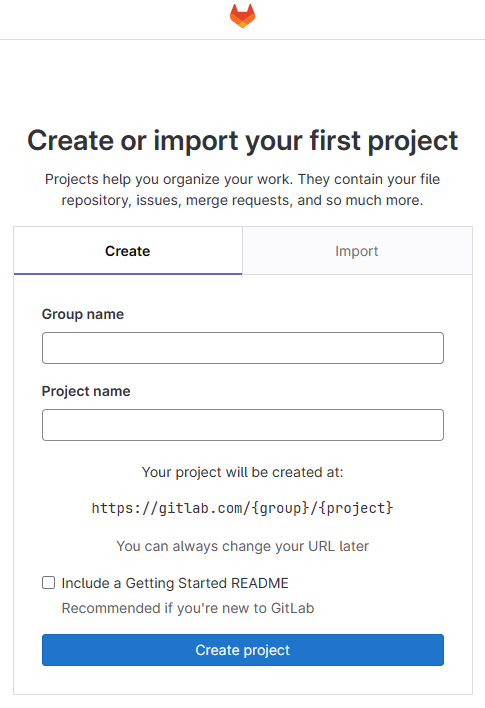

4\. Выберите пункт меню Projects и нажмите кнопку New project.


5\. Выберите Create a project для создания нового проекта.

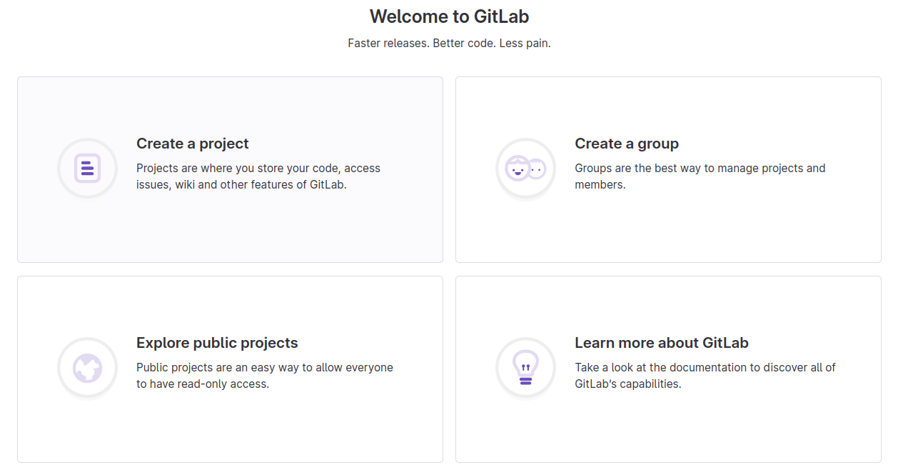

6\. Выберите Import project.

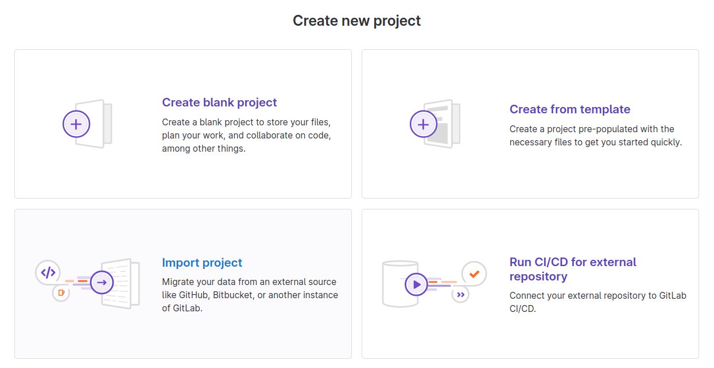

7\. Нажмите на кнопку Repository By URL и заполните поле Git repository URL ссылкой https://github.com/netology-code/ib-devsecops-app.git.

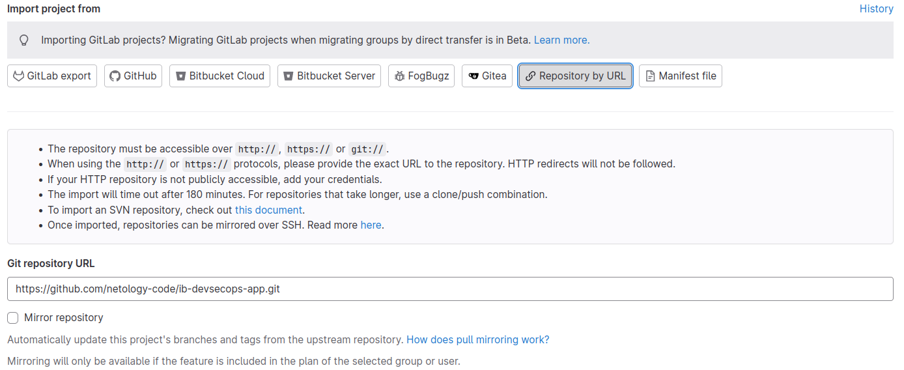

8\. Введите значения в поля Project name и Project slug и нажмите Create project.

9\. Зайдите в пункт меню CI/CD — Pipelines и нажмите на кнопку Run Pipeline.

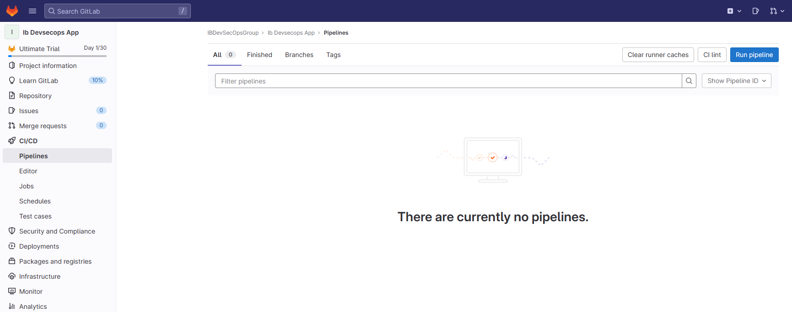

10\. Нажмите на кнопку Run Pipeline.


11\. Вы увидите сообщение о необходимости валидации аккаунта с помощью кредитной карты. Если у вас есть карта иностранного банка, вы можете воспользоваться ей. Если карты нет, следуйте дальнейшим шагам.

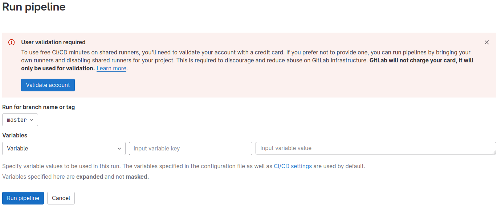

12\. Перейдите в Settings — CI/CD.

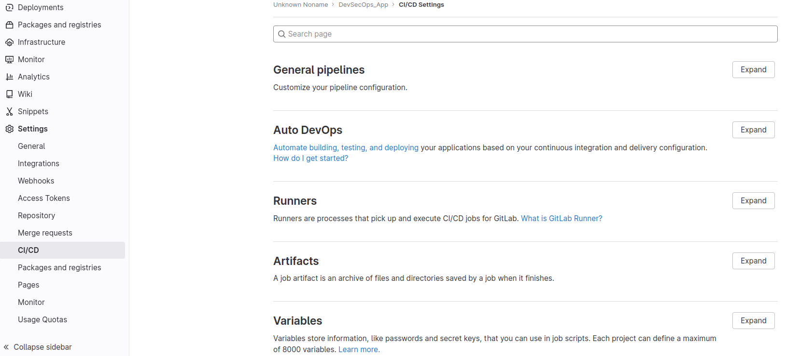

13\. Найдите пункт Runners и кликните Expand.

14\. Отключите Shared Runners. Не закрывайте эту страницу. Она понадобится нам дальше.

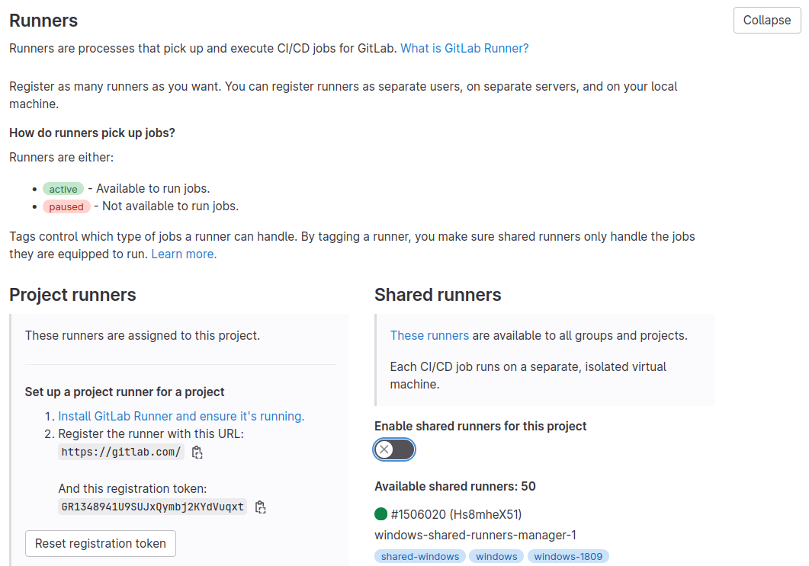

15\. Сейчас мы создадим gitlab-runner для нашего проекта.

**Установка Runner**

Откройте терминал и введите команду:

```wget https://packages.gitlab.com/install/repositories/runner/gitlab-runner/script.deb.sh```

В примере загружен скрипт для систем на базе пакетов DEB (Ubuntu, Kali).

Открываем его на редактирование:

```nano script.deb.sh```

Находим строки:

```
  # remove whitespace from OS and dist name
  os="${os// /}"
  dist="${dist// /}"
```

И меняем их на что-то подобное:

```
  # remove whitespace from OS and dist name
  os="ubuntu"
  dist="impish"
```

В этом примере описана установка, как для Ubuntu 21.10.

Запускаем скрипт:

```sudo bash script.deb.sh```

После успешной установки введите команду:

```sudo apt-get install gitlab-runner```

После установки gitlab-runner разрешаем автозапуск сервиса и стартуем его:

```sudo systemctl enable gitlab-runner --now```

**Регистрация**

Для корректной работы Runner его нужно связать с нашим проектом в GitLab.

Введите команду:

```sudo gitlab-runner register```

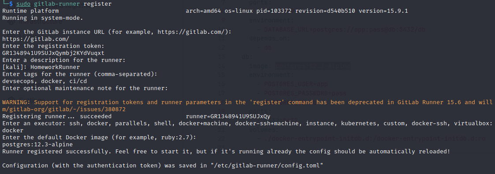

Система в интерактивном режиме запросит данные для регистрации — вводим их:

- **https://gitlab.com/** — адрес нашего сервера GitLab, его можно увидеть на странице с параметрами, которую мы оставили открытой на предыдущем шаге;

- **GR1348941U9SUJxQymbj2KYdVuqxt** — токен для регистрации раннера, его можно увидеть на странице с параметрами, которую мы открывали выше;

- **HomeworkRunner** — произвольное описание для нашего раннера;

- **devsecops, docker, ci/cd** — теги. Рекомендуется максимально точно описывать раннер тегами. С их помощью можно указывать, на каких раннерах должны выполняться те или иные задачи;

- этот пункт опционален, мы его пропускаем;

- **docker** — выбираем исполнителя из предложенных вариантов. В нашем случае это docker;

- **postgres:12.3-alpine** — базовый образ Docker, описан в файле docker-compose.yml.

Конфигурационный файл раннера находится в каталоге /etc/gitlab-runner/config.toml.

Обновим страницу с параметрами для регистрации раннера. Ниже мы должны увидеть, что у нас появился один новый элемент.

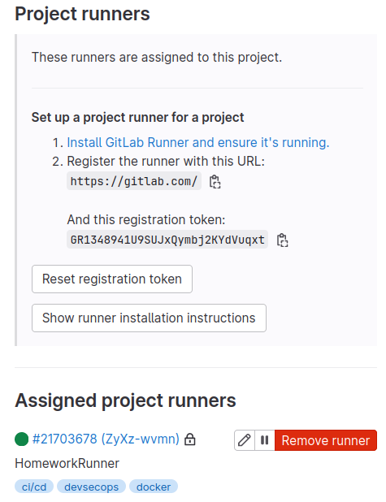

Кликните на иконку с изображением карандаша и установите параметры, как на скриншоте ниже.

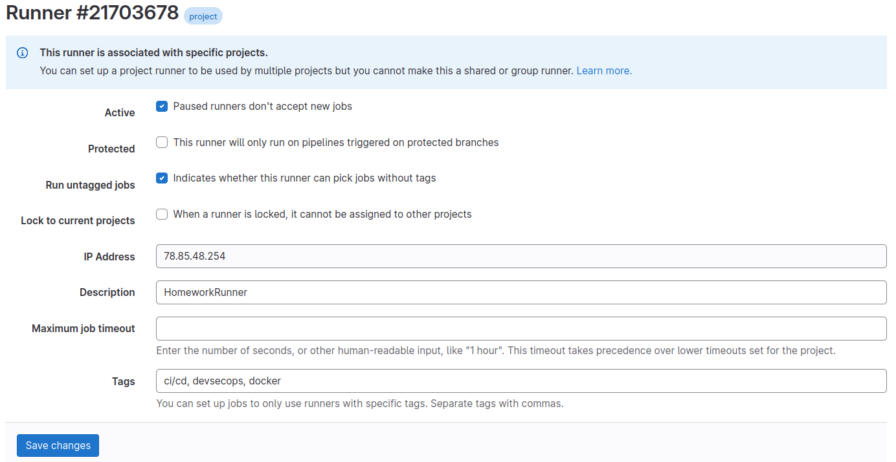

16\. Теперь раннер создан и зарегистрирован. Если вы ещё раз нажмёте Run pipeline, скорее всего, вы увидите такое состояние. Исправим это.


17\. Перейдите в /etc/gitlab-runner/.

18\. Отредактируйте config.toml следующим образом:

- найдите строку “privileged = false” и измените “false” на “true”;
- стоку “volumes = ["/cache"]” измените на “volumes = ["/var/run/docker.sock:/var/run/docker.sock", "/cache"]”.

После изменений файл должен выглядеть так:

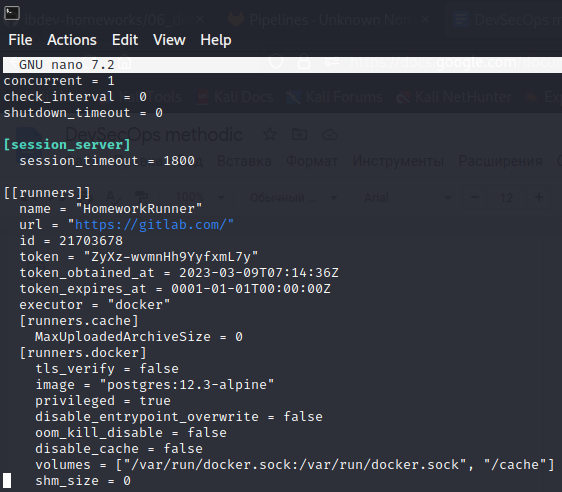

19\. Сохраните изменения в файле. После этого процесс анализа должен начаться автоматически.


20\. Дождитесь окончания процесса анализа.

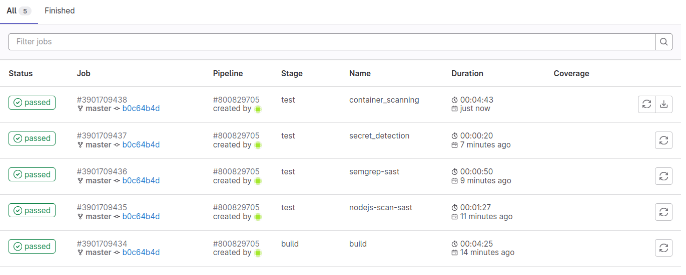

21\. Перейдите в раздел Security & Compliance.

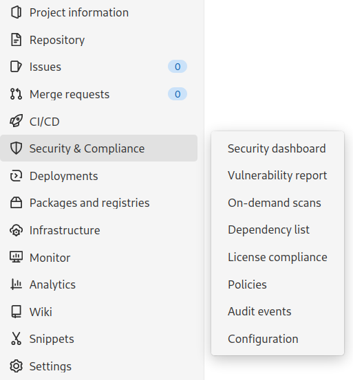

22\. Изучите внимательно разделы:

- Vulnerability Report — отчёт об уязвимостях;
- Dependency List;
- License Compliance.

### Ответьте на вопросы:

**Важно**: после окончания проверки подождите пару минут и несколько раз обновите страницу через `Shift` + `F5`. Иногда не все данные по проверкам подтягиваются сразу. Убедитесь, что уязвимости точно найдены для приложения, зависимостей и контейнера.

**Вопросы для домашнего задания** 

1\. Сколько уязвимостей и какого уровня значимости найдено (Severity)?


2\. Сколько из них:
- в самом приложении (SAST);
- в контейнерах (Container Scanning);
- в зависимостях (Dependency Scanning);
- секретов (Secret Detection)?

3\. Какая уязвимость найдена в самом приложении?
4\. Сколько зависимостей в приложении?
5\. Сколько различного рода лицензий используется в приложении и его зависимостях?

### Решение задания

Пришлите в личном кабинете ответы на вопросы из раздела «Ответьте на следующие вопросы» и скриншот статистики со всеми найденными уязвимостями. Нужны только числа в секциях `Critical`, `High`, `Medium`, `Low`.

Не удаляйте свою учётную запись после завершения работы. Она вам понадобится на следующей лекции.


