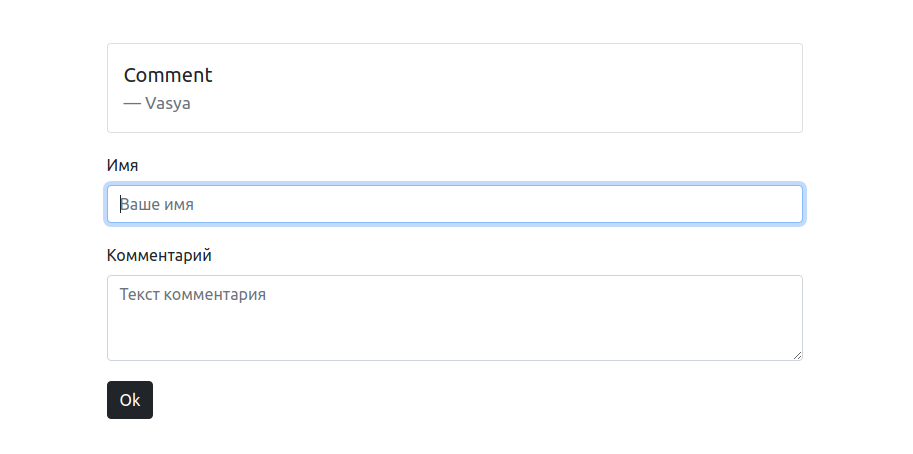

# Домашнее задание к занятию «1.4 JavaScript»

В качестве результата пришлите ответы на вопросы в личном кабинете студента на сайте [netology.ru](https://netology.ru).

## Задание Комментарии

### Легенда

Вам предоставили прототип системы комментариев для социальной сети.

### Порядок выполнения

Для запуска воспользуйтесь следующим `docker-compose.yml`:

```yaml
version: '3.7'
services:
  comments:
    image: ghcr.io/netology-code/ibweb-js-comments
    ports:
      - 9001:9001
```

Для запуска используйте команду: `docker-compose up`

Для остановки и удаления контейнеров: `docker-compose down`

Фронтенд сервиса работает на порту 9001:



1. Откройте целевой сервис в двух экземплярах браузера (обычном и приватном или в разных браузерах)
1. Отправьте ваш "вредоносный ввод" с помощью форм ввода так, чтобы он содержал код `alert('pwned')` либо его вариации в первом экземпляре браузера
1. Обновите страницу во втором экземпляре браузера: если код выполнится при загрузке или после выполнения целевых действий пользователя, например, клике (`onclick`), наведении указателя мыши (`onhover`) или других событиях ([см. полный список](https://developer.mozilla.org/en-US/docs/Web/Events)) - то вы добились своего

Примечание*: в большинстве случаев будет достаточно `onclick`.

Используя ваши знания, попробуйте подобрать данные для формы таким образом, чтобы исполнился целевой код (`alert('pwned')`).

### Результаты

В качестве результата пришлите используемые вами для ввода данные.

## Трекер*

**Важно**: это необязательное задание. Его (не)выполнение не влияет на получение зачёта по ДЗ.

### Легенда

Один из банков установил на свою страницу переводов с карты на карты сторонний трекер активности (такое часто бывает, можете посмотреть, какие сторонние скрипты подключаются на странице [Сбер Банка](https://securepayments.sberbank.ru/payment/merchants/p2p_transfer/index.html), [Альфа-Банка](https://www.alfaportal.ru/card2card/ptpl/alfaportal/initial.html) и других банков).

**Q**: что делает трекер?

**A**: он замеряет время, прошедшее с момента загрузки страницы до отправки пользователем перевода и отправляет данную статистику на сторонний сервис.

Но вот незадача: спустя какое-то время начались жалобы со стороны клиентов банка об операциях, которые они не совершали (либо о попытках подобных операций).

Внутреннее расследование установило, что всех клиентов объединяет одно: они воспользовались данной страницей (страницей передов) после установки трекера.

**Ваша задача**: проанализировать данные, которые отправляет трекер и попробовать определить, действительно ли он как-то причастен к данному происшествию.


### Порядок выполнения

Для запуска воспользуйтесь следующим `docker-compose.yml`:

```yaml
version: '3.7'
services:
  comments:
    image: ghcr.io/netology-code/ibweb-js-tracker
    ports:
      - 9002:9002
```

Для запуска используйте команду: `docker-compose up`

Для остановки и удаления контейнеров: `docker-compose down`

Фронтенд сервиса работает на порту 9002.

Тестовые карты для перевода (позаимствованы нами из [документации Сбер Банка](https://securepayments.sberbank.ru/wiki/doku.php/test_cards)):
* VISA 
    * Номер карты: 4111 1111 1111 1111 
    * Дата истечения срока действия: 2024/12
    * Проверочный код на обратной стороне: 123
* MasterCard
  * Номер карты: 5555 5555 5555 5599
  * Дата истечения срока действия: 2024/12
  * Проверочный код на обратной стороне: 123
* МИР
  * Номер карты: 2200 0000 0000 0053
  * Дата истечения срока действия: 2024/12
  * Проверочный код на обратной стороне: 123

### Результаты

В качестве результата пришлите ваше заключение о том, действительно ли трекер причастен к происшествию с клиентами. И если да, то каким именно образом (нужно обоснование на основе полученных вами данных из анализа работы трекера, из которого будет явно следовать, что он передаёт что-то, помимо заявленного времени работы).
