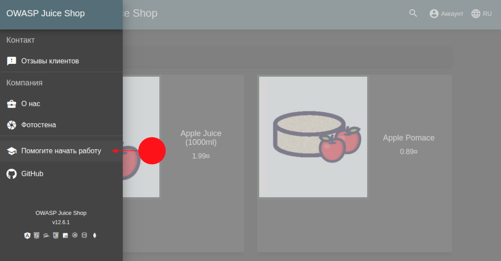
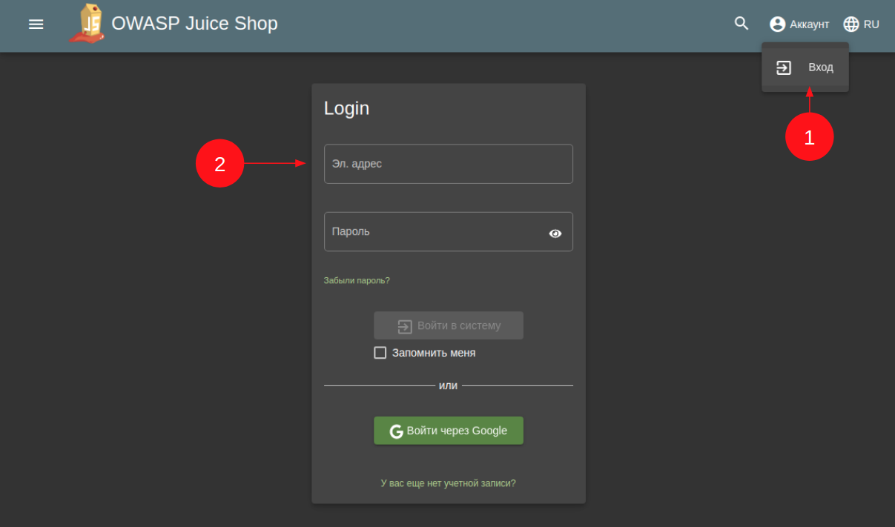

# Домашнее задание к занятию «2.1 OWASP»

В качестве результата пришлите ответы на вопросы в личном кабинете студента на сайте [netology.ru](https://netology.ru).

## Общая вводная

В рамках данного ДЗ мы будем рассматривать проект [OWASP Juice Shop](https://owasp.org/www-project-juice-shop/) один из проектов, входящих в [Vulnerable Application Directory](https://owasp.org/www-project-vulnerable-web-applications-directory/).

Для запуска воспользуйтесь следующим `docker-compose.yml`:

```yaml
version: '3.7'
services:
  shop:
    image: bkimminich/juice-shop
    ports:
      - 3000:3000
```

Приложение запустится на 3000 порту, вам необходимо открыть `localhost:3000` в браузере и выбрать русский язык:


Далее в боковой панели выбираете "Помогите начать работу":



## Задание SQLi

### Порядок выполнения

Перейдите на страницу логина:



Используя ваши знания об SQLi, попробуйте залогиниться в систему.

**Важно**: достаточно часто при работе с СУБД возникают ошибки из-за некорректно составленных SQL-запросов, превышением лимита подключений, проблем с фиксацией транзакций и т.д. Эти ошибки пробрасываются из СУБД в само приложение, которое логгирует их (записывает в лог-файл). Это позволяет программистам проводить анализ случившегося и быстрее исправлять ошибки. Достаточно часто для удобства на этапе разработки эти сообщения выводятся не только в лог-файл, но и дублируются в ответе, возвращаемом сервером по HTTP (и соответственно, могут просачиваться в Production, если кто-то забыл "отключить" данную функцию).

Соответственно, то же самое будет происходить при подборе данных для SQLi - возникнет ошибка, которая может просочиться к вам в виде HTTP ответа (тогда вы не вслепую будете подбирать данные). Откройте инструменты разработчика браузера (`F12`) и внимательно посмотрите на то, какие ответы на ваш запрос вам возвращает сервер по нажатию на кнопке "Войти в систему".

Проанализируйте под каким пользователем вам удалось войти, и ваши предположения о том, почему удалось войти именно под этим пользователем.

<details>
<summary>Подсказка</summary>

Для этого достаточно:
1. Посмотреть на хранилища (Cookie, LocalStorage, SessionStorage) на предмет хранения аутентификационной информации
1. Посмотреть на данные передаваемые в запросах (Headers)
1. Посмотреть на данные, возвращаемые в ответах после аутентификации
</details>

### Результаты

В качестве результата пришлите:
1. Использованные вами для ввода данные
1. Информацию о том, под каким пользователем вам удалось войти
1. Ваши предположения о том, почему удалось войти именно под этим пользователем
1. Информацию о том, где хранится аутентификационная информация, что она из себя представляет и как передаётся в каждом запросе

## robots.txt

Прочитайте информацию о файле [`robots.txt`](https://developers.google.com/search/docs/advanced/robots/intro?hl=ru) и [детальное его описание](https://developers.google.com/search/docs/advanced/robots/robots_txt?hl=ru).

А также ознакомьтесь с соответствующими статьями на сайтах компаний, занимающихся информационной безопасностью:
* [Tenable](https://www.tenable.com/plugins/nessus/10302)
* [Synopsis](https://www.synopsys.com/blogs/software-security/robots-txt/)

### Порядок выполнения

На основании полученной информации попробуйте проанализировать целевой сервис на предмет корректности использования `robots.txt`.

### Результаты

В качестве результата пришлите: ваше заключение о том, корректно ли используется `robots.txt` (если нет, то почему и к каким это ведёт последствиям)
